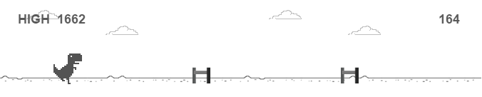

# react-dinosaur-game

仿制 Chrome 的离线恐龙游戏实现的 React 组件。



## Usage

```
$ npm i react-dinosaur-game -S
```

```
import Game from 'react-dinosaur-game';

...

render() {
    return <Game />;
}
```

## Document

### props

```
options: {
      fps: Number, defauult 60,
      skySpeed: Number, default 40,
      groundSpeed: Number, default 100
}
```
